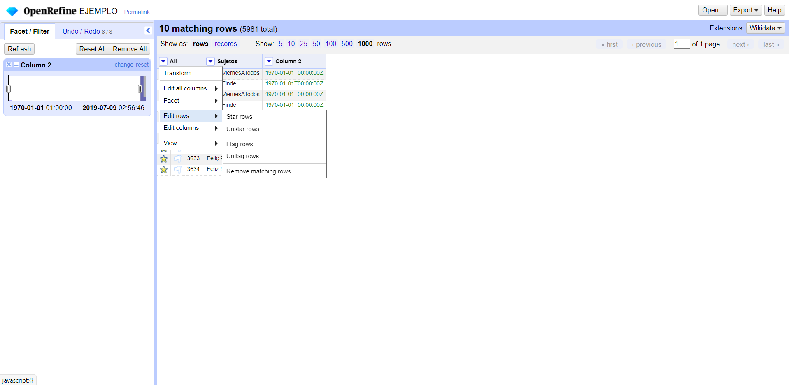
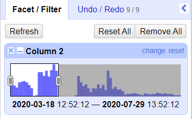

# Practica-3-visualización

## Enlaces a las infografías:

Número de veces que hashtags valorativos de "FelipeVI" han sido “trending topic” entre marzo y julio de 2020: https://datawrapper.dwcdn.net/Wl5R0/1/

Número de veces que hashtags de cumpleaños con la fórmula FelizCumple_____ han sido “trending topic” entre marzo y julio de 2020: https://datawrapper.dwcdn.net/VPe5u/1/

## Proceso de selección y limpieza de datos

En el presente trabajo quería visualizar, a partir del documento “feliz.csv” y mediante gráficos circulares (o de tarta), los datos que indican el número de veces que determinados mensajes fueron tendencia (“trending topic”) en un periodo de tiempo. Para ello sometí al archivo a un proceso de limpieza y selección de datos para el cual empleé la herramienta OpenRefine.
Para ambos gráficos seguí pasos similares. Primero configuré el proyecto tal y como se muestra en la siguiente imagen:

A continuación, borré las columnas 1,4,5 y 6, trasladé la columna 3 al inicio y la renombré como “Sujetos”.

Después usé “common transformations” para que los datos de las celdas de la columna 2 fueran leídos como fechas. Hecho esto, apliqué la faceta de línea de tiempo sobre la misma columna 
y con la herramienta de “edit rows” y “star rows” me quedé solo con los datos contenidos entre el 18 de marzo de 2020 y el 29 de julio de 2020. Escogí esta franja por ser la más activa 
de todo el documento (como se puede observar en la Timeline).

Una vez tuve la horquilla temporal deseada, usé la faceta de texto en la columna “Sujetos” (en la que puedo ver el nº de veces que aparece cada palabra, hashtag, nombre, etc) 
y luego el filtro de texto, en el que escribí “FelipeVI” pues quería quedarme solo con aquellos hashtags que dan una opinión acerca de Felipe VI. Es por esta razón que descarté "#FelipeVI": 
no aporta ninguna opinión acerca de él. Para excluirlo usé la faceta de texto como se ve en la imagen.

Al ser mi objetivo representar en una visualización de datos la frecuencia que tuvieron cada uno de estos mensajes dentro del periodo mencionado, necesitaba crear una columna 
que reflejara las cantidades quese ven en la faceta de texto (es decir, que mostrara que “#VivaElReyFelipeVI” aparece 2 veces, “#FelipeVIFarsante” aparece 4, etc). Para ello usé 
la opción “add column based on this column”. A esta nueva columna la nombré “Repeticiones” y en la caja de texto escribí la siguiente función:

value.facetCount("value", "Sujetos")

De esta manera mi nueva columna tendrá en cada celda el número de veces que aparece un valor en la columna “Sujetos”, como vemos en la tercera imagen de abajo.

Ahora, para la visualización adecuada, necesito que solo halla un dato por cada celda en ambas columnas (“Sujetos” y “Repeticiones”), pues de no ser así cada celda será representada como un dato individual y, así, el hashtag #PírateYaFelipeVI aparecería 22 veces, lo que no favorece a la representación y fácil lectura de la información.

Primero, para quedarme con una celda por cada dato, las organicé por orden alfabético y en cada caso borré todas las celdas idénticas menos 1, que será la representativa en el documento que se suba a datawrapper. Para ello usé la pestaña “editar” que aparece ubicando la flecha encima de una celda. En el ejemplo de abajo he borrado una de las dos celdas de la columna “Sujetos” que contiene “#VivaElReyFelipeVI”. Una vez que tengo la celda única en cada uso la opción “Facet” en la columna “Sujetos” y dentro de “Customized Facets” elijo “Facet by blank”. De esta manera elimino todas las celdas en blanco y me quedan solo con las que trabajaré en la visualización.

Exporto el documento y lo nombro como Proyecto 1 y será el que convierta en la primera infografía.

Para la segunda infografía los pasos son exactamente los mismos, pero esta vez busco todas las veces que ha sido tendencia la fórmula #FelizCumple______, como se ve en la imagen siguiente.

De esta manera ya tenemos dos conjuntos de datos limpios con los cuales trabajar.

### Proceso de creación de las infografías

En ambas infografías he seguido exactamente los mismos pasos, pues he escogido gráficos circulares (o de tarta), ya que son efectivos para representar proporciones dentro de un total 
(por ejemplo qué hashtagha sido el más frecuente dentro del conjunto escogido). Además, como no manejo una cantidad demasiado grande de datos en ambas muestras (menos de 10), 
emplear este tipo de infografía me pareció lo más visual.

Una vez dentro de la página de Datawrapper subí a la página el archivo Excel al que había exportado el proyecto. En el tercer paso “Visualize” elegí un color distinto para cada 
sección, de manera que ningunase pareciera a otra. En ambos casos decidí que mostrara todos los valores dentro de la leyenda. En el cuarto paso, “Publish and embed” decidí publicarlo 
para usar la dirección, en lugar del png. Esto lo decidí así porque permite una mayor interacción con los datos que se muestran. 

