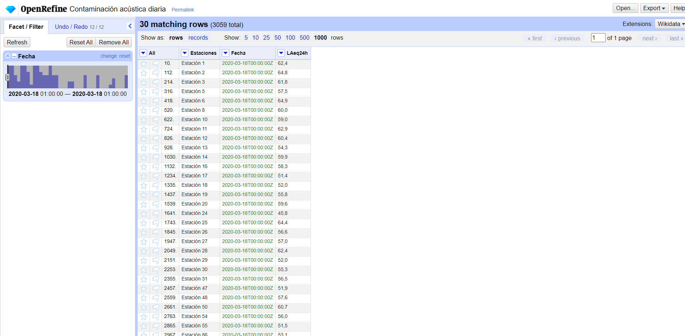

# Practica-4-historia-periodismo-datos

## Enlaces a las infografías

Contaminación acústica 18 de marzo: https://datawrapper.dwcdn.net/Gx1PL/3/

Contaminación acústica 18 de abril: https://datawrapper.dwcdn.net/6pxb0/2/

Estos diagramas de puntos (dot plot) permiten observar lo alejados que están unos de otros los niveles de ruido registrados en cada una de las 30 estaciones de la Red Fija de Vigilancia de la Contaminación Acústica. Con el eje x puedo localizar el valor numérico de los puntos y con el eje y puedo ubicar la estación de cada dato. La interactividad de la visualización también me permite ver específicamente los valores de cada uno de los puntos, que poseen un color rojo representativo de la bandera municipal y autonómica de Madrid.

## Memoria

### Proceso de selección y limpieza de datos

Para seleccionar la información de este trabajo acudí al portal “datos.gob.es” que es la plataforma en la que se organiza y categoriza el Catálogo Nacional de Datos Abiertos. En este trabajo decidí centrarme en la contaminación acústica dentro de la ciudad de Madrid y, finalmente, usando para acotar el periodo en el que quiero centrarme, busqué específicamente los niveles de contaminación acústica en la ciudad durante el primer año de la pandemia de COVID-19 (2020). El enlace del conjunto de datos que escogí finalmente es [este] (https://datos.gob.es/es/catalogo/l01280796-covid-19-contaminacion-acustica-datos-diarios-con-actualizacion-semanal).

Mi objetivo es comparar los niveles de contaminación acústica en la ciudad en dos días distintos (el 18 de marzo y el 18 de abril) y, por ende, escogí el archivo “.csv” de los datos diarios de contaminación acústica recogidos por las 30 estaciones de Red Fija de Vigilancia de la Contaminación Acústica (una serie de estaciones repartidas por la ciudad que se encargan de captar información relativa a la condición acústica de su entorno).
Una vez descargado el archivo, usé Openrefine para limpiar los datos y quedarme solo con los del 18 de marzo, en un primer archivo, y los del 18 de abril, en otro. Para ambos casos usé la siguiente configuración inicial:

Dentro del proyecto usé las transformaciones comunes en la columna “Fechas” para que las celdas fueran leídas en formato fecha y, a continuación, usé la faceta de línea de tiempo y la selección mediante estrellas para borrar todos los datos anteriores al 18 de marzo de 2020. Para la visualización solo me interesaban los datos numéricos recogidos en la columna “LAeq24h”, que se refieren al “Nivel sonoro equivalente diario”, ya que me parecen los más representativos de toda la información recogida en toda una jornada. De manera que borré las columnas “Ld”, “Le” y “Ln” que se refieren, respectivamente, al “nivel sonoro continuo equivalente del periodo día”, “nivel sonoro continuo equivalente del periodo tarde” y “nivel sonoro continuo equivalente del periodo noche”. Después creo una nueva columna basada en “Estación”. La llamo “Estaciones” y en la caja de texto en lenguaje GREL escribo la expresión "Estación "+ value”. Así, cuando quiera crear la gráfica a partir de estas columnas las estaciones serán leídas como texto y no como número por Datawrapper. Finalmente borro la columna “Estación” para tener las 3 columnas con las que quiero trabajar:

